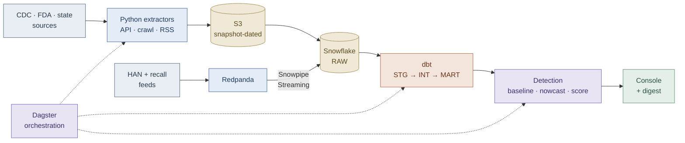

[README (13).md](https://github.com/user-attachments/files/30169952/README.13.md)
# Public Health Outbreak Monitoring System

Detects outbreak signals against season-aware baselines, corrects for reporting lag, and surfaces prioritized alerts — before the news does.

`status: in active development` · `portfolio capstone` · [Decision brief](docs/decision-brief.pdf) · [ADRs](docs/adr/) · [Backtest](docs/backtest.md)

**Stack:** Python · S3 · Snowflake · dbt · Dagster · Redpanda · Firecrawl · React/Next.js

---

## The problem

Public health surveillance data is slow, and it lies at the edges.

Most CDC feeds update weekly. Confirmed counts lag real illness by weeks. And the most recent weeks are **always incomplete** — which makes a rising outbreak look like a declining one at exactly the moment you'd want to act:

```
Reported counts                    Nowcast-corrected
Week 25  ██████████████  358       Week 25  ███████████████▒  358 → 371
Week 26  █████████       241       Week 26  ██████████████▒▒  241 → 389
Week 27  ████            108       Week 27  ████████████▒▒▒▒  108 → 402
         "declining"                        flat-to-rising
```

Same data. Opposite conclusion.

This system is built *around* that constraint rather than pretending it isn't there. It is deliberately **not** a real-time pipeline — claiming real-time on lagged data is the tell of someone who doesn't understand the domain.

---

## Two techniques carry the project

**Season-aware baselining.** Establishes what normal looks like for a given disease × state × week-of-year, learned from historical years. An alert means "unusually high for this week" — not just "high." (Cyclospora sits near zero outside summer, so the baseline must degrade gracefully at small denominators where ratio scores explode.)

**Reporting-lag nowcasting.** Learns how much each recent week gets revised upward, then estimates where counts actually are, with an uncertainty band. Prevents the false-comfort "cases are declining" artifact. Learned from an append-only revision log, not re-derived snapshot diffs at query time.

Everything else — ingestion, warehousing, orchestration, the console — exists to make those two techniques possible and honest.

---

## The finding this project is built to produce

Applied to the **2026 cyclosporiasis outbreak** using only data available at each point in time: does the monitor flag an anomalous produce-linked signal before it reaches national news, while suppressing the false declining reading?

> **Success criteria are pre-registered, before the backtest runs.** A target defined after seeing the outcome is self-deception. If the lead time is modest, that is the result and it ships as written.

| Criterion | Target | Status |
|:--|:--|:--:|
| Lead time vs. mainstream coverage | Reported as a range across alert thresholds, never a single number | pending |
| False-alarm rate | Reported at each threshold in the same sweep (precision/recall) | pending |
| Earliness delta | Days the crawl lane led the NNDSS API for the same signal — may legitimately be zero | pending |
| Definition of success | A defensible lead at *some* threshold, at a false-alarm rate a real operator would tolerate | locked |

If the earliness delta comes back at zero, that is a reportable finding about the crawl lane — not a failure to hide.

---

## Architecture



**Flow:** four lanes land data on their own terms — Socrata polls and a poll-over-poll revision diff go to S3 as snapshot-dated files (never overwritten), crawled pages are first-seen stamped, and the event lane streams through Redpanda into Snowflake via Snowpipe Streaming. dbt builds staging → intermediate (harmonize · revision history · lag profile) → marts (baseline · nowcast · anomaly · backtest). Detection scores against the baseline, modulates by corroboration, and emits one frozen payload that both the console and the digest render. Dagster orchestrates the whole chain; no LLM sits in the alerting path.

### Four ingestion lanes, each chosen by what the source actually offers

| Lane | Sources | Access | Why this pattern |
|:--|:--|:--|:--|
| API | NNDSS, CDC CFA Rt | Socrata, scheduled poll | Publishes weekly — polling matches the cadence |
| Revision | NNDSS poll-over-poll diff | Batch job → append-only table | The diff inherits the poll schedule; a broker adds cost without adding anything the model consumes |
| Crawl | FDA CORE, state/county dashboards | Firecrawl, timed | No API exists; these pages carry the leading edge |
| Event | HAN, FDA/USDA recalls, state advisories | RSS/Firecrawl → Redpanda | Genuinely irregular arrival, no schedule to poll against |

> **The event lane's existence is conditional.** Its arrival rate is measured before the build starts. If the feeds don't produce genuinely bursty traffic, the lane drops to a Dagster sensor and the ADR records the measurement and the cut. Sources are not added to justify a tool.

### Source tiering

In an alerting system, a bad source is worse than a missing one.

- **Tier 1 — drives alerts.** Federal APIs + official state/county/agency pages. Crawled only where no API exists.
- **Tier 2 — corroboration, never fires alone.** The advisory/recall event lane raises or damps confidence on a Tier 1 signal; it never originates one.
- **Tier 3 — deliberately excluded.** News aggregators and unverified trackers, named here with the reason rather than quietly omitted.

---

## Architecture decisions

**Batch where scheduled, stream only where arrival is irregular.**
The count feeds publish weekly; streaming them would be theater, and the same logic applies to their deltas. The revision diff runs as a batch job appending to an append-only revision log. Redpanda is carried by the event lane alone — the broker is on the résumé because that lane needs it, not because streaming was applied wherever it could be.

**The event lane is conditional on measured arrival rate.**
HAN alone is a handful of advisories a month. The lane starts at 2–3 feeds; if the measured combined rate doesn't justify a broker, it drops to a Dagster sensor and the ADR records the measurement and the cut.

**No LLM in the alerting path.**
An LLM classifier over FDA CORE text was scoped and removed. Probabilistic classification is least welcome on an alert-driving path; a deterministic extractor over a locked (disease, state, date-window) scope is more defensible. The consideration and the rejection are the deliverable.

**Snapshot-dated S3 keys, never overwrite.**
Keys carry the pull date, not just the reporting week, because CDC revises prior weeks as late cases arrive. Overwrite-on-rerun would destroy the exact signal the nowcast learns from.

**Firecrawl only where data lives exclusively in pages — and the earliness is measured.**
Every crawled item is stamped with a first-seen timestamp; the backtest reports the delta against NNDSS first-appearance. A claim about tool fit that carries a number beats the same claim asserted — and gives a defensible basis for cutting the lane if the number is near zero.

**Disease-as-config from the first commit.**
Disease is a dimension (seasonality type, expected lag, alert-eligibility), not hardcoded logic. Scoped to 2–3 diseases chosen for contrast: cyclosporiasis (seasonal, foodborne, long lag — the anchor) plus a low-count sporadic disease that tests small-sample robustness.

**Frozen payload contract — console and digest are peers.**
The anomaly mart emits one schema, frozen before either consumer is built, so frontend work runs parallel to detection:

```json
{
  "disease": "cyclosporiasis",
  "jurisdictions": ["MI", "OH", "IN"],
  "score": 3.42,
  "fired": true,
  "reason_code": "BASELINE_EXCEEDED_SUSTAINED",
  "corroboration_count": 2,
  "earliness_delta_days": 9,
  "nowcast_band": { "point": 402, "low": 361, "high": 448 },
  "data_current_through": "2026-W27"
}
```

---

## Scope discipline

| In scope | Explicitly out |
|:--|:--|
| One baseline method + one lag model, explainable end to end | A survey of anomaly detection techniques |
| 2–3 diseases chosen for contrast | The full notifiable disease list |
| Corroboration as a scoped join on (disease, state, date window) | Fuzzy entity matching across sources |
| Console re-queries on load or light interval | Websocket/push updates for daily-moving data |
| Real "data current through week N" timestamp | Wall-clock render time masquerading as freshness |

## Known risks this plan owns

| Risk | Mitigation |
|:--|:--|
| Backtest lead time is not under my control | Pre-registered success range + threshold sweep — a modest lead still ships as a credible artifact |
| Corroboration-join creep into entity resolution | Scope locked to (disease, state, date window); anything richer is explicitly out |
| Off-season zero counts producing garbage scores | Verified against historical off-season data before the nowcast build starts |
| Earliness delta comes back near zero | Reportable finding, not a failure — becomes a cut-with-evidence decision |
| Streaming learning-curve tax | One brokered lane only, built after the arrival-rate check confirms it should exist |

## Data sources

All public, all free, no API keys required for the core sources.

| Source | Provides | Lane |
|:--|:--|:--|
| NNDSS weekly tables (`data.cdc.gov`) | The spine — counts by state × week, provisional and revised as late cases arrive | API + Revision |
| CDC CFA epidemic-trend (Rt) | Model-ready respiratory signal; second detection pattern | API |
| FDA CORE outbreak table | The leading edge, before a signal becomes a number in NNDSS | Crawl |
| CDC Health Alert Network | Urgent advisories, genuinely event-shaped | Event |
| FDA / USDA FSIS recalls | Product-level recalls; independent corroboration | Event |
| State / county dashboards | Hotspot detail at county grain, ahead of federal aggregation | Crawl |

## Scope boundary

> This is **early-warning risk monitoring on public data.** It is not food-safety certification and makes no regulatory or clinical claim. The system surfaces public signals faster; it does not adjudicate safety.

## Repository layout

```
outbreak-monitoring-system
├── docs/
│   ├── decision-brief.pdf      # full project brief
│   ├── backtest.md             # pre-registered criteria + results
│   └── adr/                    # architecture decision records
├── ingestion/
│   ├── api/                    # Socrata extractors
│   ├── revision/               # poll-over-poll batch diff
│   ├── crawl/                  # Firecrawl lane, first-seen stamped
│   └── events/                 # advisory/recall feeds → Redpanda
├── dbt/models/
│   ├── staging/
│   ├── intermediate/           # harmonize · revision history · lag profile
│   └── marts/                  # baseline · nowcast · anomaly · backtest
├── detection/                  # baseline, nowcast, scoring
├── orchestration/              # Dagster definitions
├── console/                    # React/Next.js
└── config/diseases/            # disease-as-config dimension
```

---

*Portfolio capstone. The client scenario in the decision brief is illustrative; the backtest target is a real evaluation against the live 2026 cyclosporiasis outbreak.*
