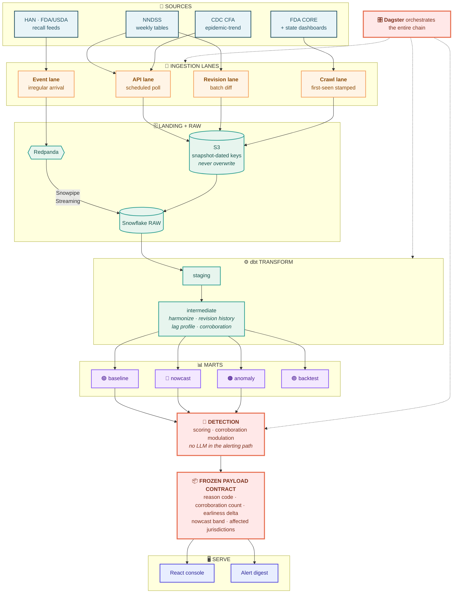
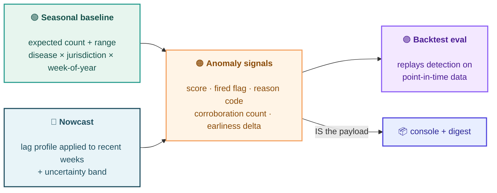
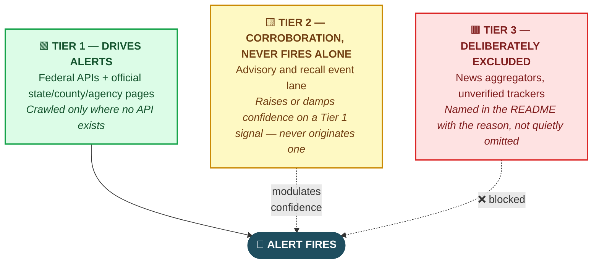

<div align="center">

# 🦠 Public Health Outbreak Monitoring System

**Detects outbreak signals against season-aware baselines, corrects for reporting lag, and surfaces prioritized alerts — before the news does.**

[](.)
[](.)
[](LICENSE)

<br>


[Decision brief](docs/decision-brief.pdf) · [ADRs](docs/adr/) · [Backtest results](docs/backtest.md)

</div>

---

## 📌 The problem

> Public health surveillance data is slow, and it lies at the edges.

Most CDC feeds update weekly. Confirmed case counts lag real illness by weeks. And the most recent weeks are **always incomplete** — which makes a rising outbreak look like a declining one at exactly the moment you'd want to act.

<table>
<tr>
<td width="50%" valign="top">

### ❌ What naive monitoring shows

```
Week 24  ████████████████  412
Week 25  ██████████████    358
Week 26  █████████         241
Week 27  ████              108   ← "declining!"
```

*Reads as a resolving outbreak. Act accordingly.*

</td>
<td width="50%" valign="top">

### ✅ What lag-corrected nowcasting shows

```
Week 24  ████████████████  412
Week 25  ███████████████▒  358 → 371
Week 26  ██████████████▒▒  241 → 389
Week 27  ████████████▒▒▒▒  108 → 402   ← flat-to-rising
```

*Same data. Opposite conclusion.*

</td>
</tr>
</table>

This system is built **around** that constraint rather than pretending it isn't there. It is deliberately **not** a real-time pipeline — claiming real-time on lagged data is the tell of someone who doesn't understand the domain.

---

## 🎯 Two techniques carry the project

<table>
<tr>
<td width="50%" valign="top">

### 📈 Season-aware baselining

Establishes what *normal* looks like for a given **disease × state × week-of-year**, learned from historical years.

An alert means **"unusually high for this week"** — not just "high."

> Cyclospora sits near zero outside summer, so the baseline must degrade gracefully at small denominators where ratio scores explode.

</td>
<td width="50%" valign="top">

### 🔮 Reporting-lag nowcasting

Learns how much each recent week gets revised upward, then estimates where counts **actually are**, with an uncertainty band.

Prevents the false-comfort **"cases are declining"** artifact.

> Learned from an append-only revision log, not re-derived snapshot comparisons at query time.

</td>
</tr>
</table>

Everything else in the stack — ingestion, warehousing, orchestration, the console — exists to make those two techniques possible and honest.

---

## 🔬 The finding this project is built to produce

Applied to the **2026 cyclosporiasis outbreak** using *only data available at each point in time* — does the monitor flag an anomalous produce-linked signal before it reaches national news, while correctly suppressing the false declining reading?

> [!IMPORTANT]
> **Success criteria are pre-registered below, before the backtest runs.** A target defined after seeing the outcome is self-deception. If the lead time is modest, that is the result and it ships as written.

| Criterion | Target | Status |
|:---|:---|:---:|
| **Lead time** vs. mainstream coverage | Reported as a range across alert thresholds, never a single number | ⏳ |
| **False-alarm rate** | Reported at each threshold in the same sweep (precision/recall) | ⏳ |
| **Earliness delta** | Days the crawl lane led the NNDSS API for the same signal — may legitimately be zero | ⏳ |
| **Definition of success** | A defensible lead at *some* threshold, at a false-alarm rate a real operator would tolerate | 📌 locked |

If the earliness delta comes back at zero, that is a **reportable finding** about the crawl lane — not a failure to hide.

---

## 🏗️ Architecture



### 🛤️ Four ingestion lanes, each chosen by what the source actually offers

| | Lane | Sources | Access | Why this pattern |
|:---:|:---|:---|:---|:---|
| 🔵 | **API** | NNDSS, CDC CFA Rt | Socrata API, scheduled poll | Publishes weekly — polling matches the cadence |
| 🟢 | **Revision** | NNDSS poll-over-poll diff | Batch job → append-only table | The diff inherits the poll schedule, so a broker adds cost without adding anything the model consumes |
| 🟠 | **Crawl** | FDA CORE, state/county dashboards | Firecrawl, timed | No API exists; these pages carry the leading edge |
| 🔴 | **Event** | HAN, FDA/USDA recalls, state advisories | RSS/Firecrawl → Redpanda | Genuinely irregular arrival, no schedule to poll against |

> [!NOTE]
> **The event lane's existence is conditional.** Its arrival rate is measured before the build starts. If the feeds don't produce genuinely bursty traffic, the lane drops to a Dagster sensor and the ADR records the measurement and the cut. Sources are not added to justify a tool.

### 📊 The four marts



---

## 🚦 Source tiering

> In an alerting system, a **bad source is worse than a missing one.**



---

## 🧭 Architecture decisions

<details>
<summary><b>⚡ Batch where scheduled, stream only where arrival is irregular</b></summary>
<br>

The count feeds publish weekly, so streaming them would be theater — and the same logic applies to their deltas. The revision diff inherits the poll's schedule, so it runs as a batch job appending change records to an append-only revision log.

**Redpanda is carried by the event lane alone**, where arrival genuinely has no schedule. The honest framing, kept deliberately: the broker is on the résumé because the event lane needs it — not because streaming was applied wherever it could be.

</details>

<details>
<summary><b>📏 The event lane's existence is conditional on measured arrival rate</b></summary>
<br>

HAN alone is a handful of advisories a month, which a Dagster sensor would handle without a broker. The lane starts at 2–3 feeds and its existence is **decided by data before the first build weekend**: count the actual arrival rate of candidate feeds over a month.

If the combined rate supports bursty irregular arrival with real fan-out (corroboration mart, digest trigger), the broker is justified. If not, the lane drops to a Dagster sensor and the ADR records the measurement and the cut.

</details>

<details>
<summary><b>🚫 No LLM in the alerting path</b></summary>
<br>

An LLM classifier over FDA CORE investigation text was scoped and **removed**. FDA CORE is a Tier 1 source, and probabilistic classification on an alert-driving path is where non-determinism is least welcome. A deterministic extractor over a locked (disease, state, date-window) scope is more defensible.

**The consideration and the rejection are the deliverable here** — this ADR is the artifact, not an integration.

</details>

<details>
<summary><b>🔑 Snapshot-dated S3 keys, never overwrite</b></summary>
<br>

Keys carry the **pull date**, not just the reporting week, because CDC revises prior weeks as late cases arrive. Capturing those revisions over time is the raw material the nowcast learns the lag from.

Overwrite-on-rerun would destroy the exact signal the entire project depends on.

</details>

<details>
<summary><b>🕷️ Firecrawl only where data lives exclusively in pages — and the earliness is measured</b></summary>
<br>

All `data.cdc.gov` sources come through the Socrata API. Firecrawl is reserved for state/county pages and the FDA CORE table, which have no API. Crawling a clean Socrata API would be strictly worse and a reviewer would clock it instantly.

Every crawled item is **stamped with a first-seen timestamp**, and the backtest reports the delta against NNDSS first-appearance. A claim about tool fit that carries a number is worth more than the same claim asserted — and gives a defensible basis for cutting the lane if the number comes back near zero.

</details>

<details>
<summary><b>🧬 Disease-as-config from the first commit</b></summary>
<br>

Disease is a dimension carrying seasonality type, expected lag, and alert-eligibility — not hardcoded logic. Adding one is a config line plus a backfill, not new code.

Scoped to **2–3 diseases chosen for contrast, not coverage**: cyclosporiasis (seasonal, foodborne, long lag — the anchor) plus a low-count sporadic disease that tests robustness against small-sample false alarms.

</details>

<details>
<summary><b>📦 Frozen payload contract — console and digest are peers</b></summary>
<br>

The anomaly mart emits **one schema**, frozen before either consumer is built:

```json
{
  "disease": "cyclosporiasis",
  "jurisdictions": ["MI", "OH", "IN"],
  "score": 3.42,
  "fired": true,
  "reason_code": "BASELINE_EXCEEDED_SUSTAINED",
  "corroboration_count": 2,
  "earliness_delta_days": 9,
  "nowcast_band": { "point": 402, "low": 361, "high": 448 },
  "data_current_through": "2026-W27"
}
```

Both the console and the alert digest render this contract, which lets frontend work run **parallel to** detection instead of queueing behind it.

</details>

---

## ✂️ Scope discipline

Deliberately constrained, with the reasoning recorded rather than discovered later.

| ✅ In scope | ❌ Explicitly out |
|:---|:---|
| One baseline method + one lag model, explainable end to end | A survey of anomaly detection techniques |
| 2–3 diseases chosen for contrast | The full notifiable disease list |
| Corroboration as a scoped join on (disease, state, date window) | Fuzzy entity matching across sources |
| Console re-queries on load or light interval | Websocket/push updates for daily-moving data |
| Real "data current through week N" timestamp | Wall-clock render time masquerading as freshness |

---

## ⚠️ Known risks this plan owns

| Risk | Mitigation |
|:---|:---|
| 🎯 Backtest lead time is not under my control | Pre-registered success range + threshold sweep — a modest lead still ships as a credible artifact |
| 🕸️ Corroboration-join creep into entity resolution | Scope locked to (disease, state, date window); anything richer is explicitly out |
| 0️⃣ Off-season zero counts producing garbage scores | Verified against historical off-season data **before** the nowcast build starts |
| 📉 Earliness delta comes back near zero | Reportable finding, not a failure — becomes a cut-with-evidence decision |
| 📚 Streaming learning-curve tax | One brokered lane only, built after the arrival-rate check confirms it should exist |

---

## 📡 Data sources

> All public. All free. No API keys required for the core sources.

| Source | Provides | Lane |
|:---|:---|:---|
| **NNDSS weekly tables** `data.cdc.gov` | The spine — notifiable disease counts by state × week, provisional and revised as late cases arrive | 🔵 API + 🟢 Revision |
| **CDC CFA epidemic-trend (Rt)** | Model-ready respiratory signal; second detection pattern | 🔵 API |
| **FDA CORE outbreak table** | The leading edge, before a signal becomes a number in NNDSS | 🟠 Crawl |
| **CDC Health Alert Network** | Urgent advisories, genuinely event-shaped | 🔴 Event |
| **FDA / USDA FSIS recalls** | Product-level recalls; independent corroboration | 🔴 Event |
| **State / county dashboards** | Hotspot detail at county grain, ahead of federal aggregation | 🟠 Crawl |

---

## 🛑 Scope boundary

> [!WARNING]
> This is **early-warning risk monitoring on public data.** It is not food-safety certification and makes no regulatory or clinical claim. The system surfaces public signals faster; it does not adjudicate safety.

---

## 📁 Repository layout

```
📦 outbreak-monitoring-system
├── 📄 docs/
│   ├── decision-brief.pdf          # full project brief
│   ├── backtest.md                 # pre-registered criteria + results
│   └── adr/                        # architecture decision records
├── 🔌 ingestion/
│   ├── api/                        # Socrata extractors
│   ├── revision/                   # poll-over-poll batch diff
│   ├── crawl/                      # Firecrawl lane, first-seen stamped
│   └── events/                     # advisory/recall feeds → Redpanda
├── ⚙️ dbt/
│   └── models/
│       ├── staging/
│       ├── intermediate/           # harmonize · revision history · lag profile
│       └── marts/                  # baseline · nowcast · anomaly · backtest
├── 🧠 detection/                    # baseline, nowcast, scoring
├── 🎛️ orchestration/                # Dagster definitions
├── 🖥️ console/                      # React/Next.js
└── 🧬 config/
    └── diseases/                   # disease-as-config dimension
```

---

<div align="center">

**Portfolio capstone** · The client scenario in the decision brief is illustrative<br>
The backtest target is a real evaluation against the live 2026 cyclosporiasis outbreak

</div>
